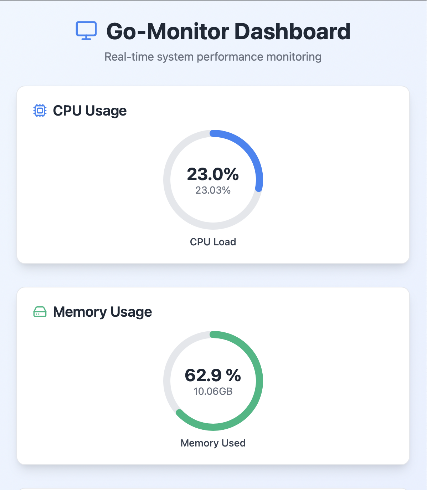
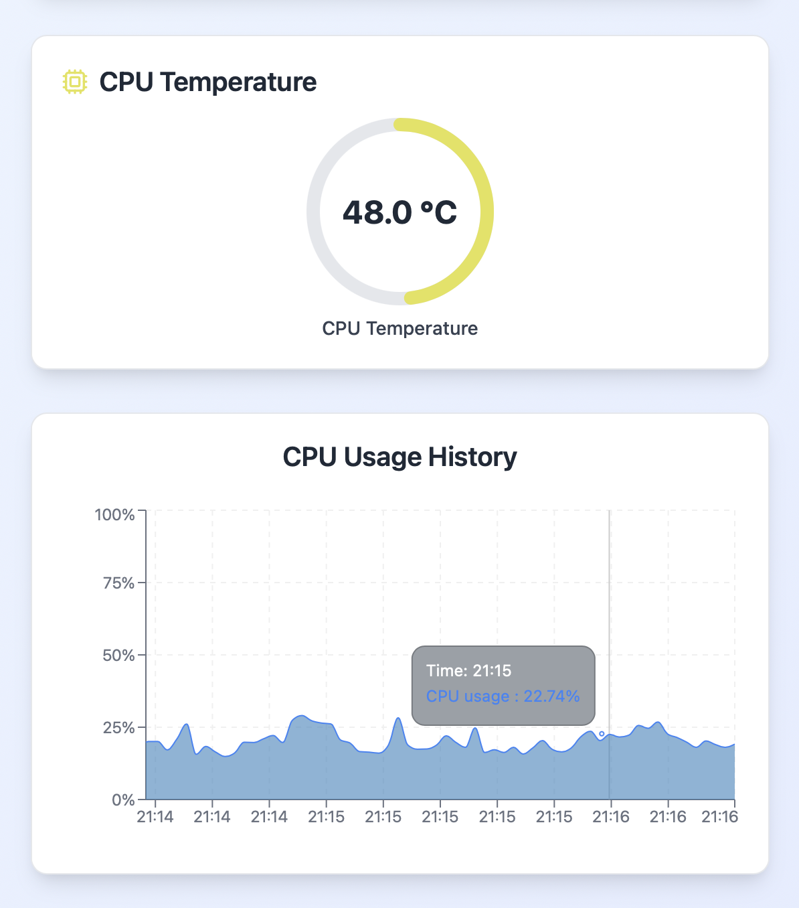
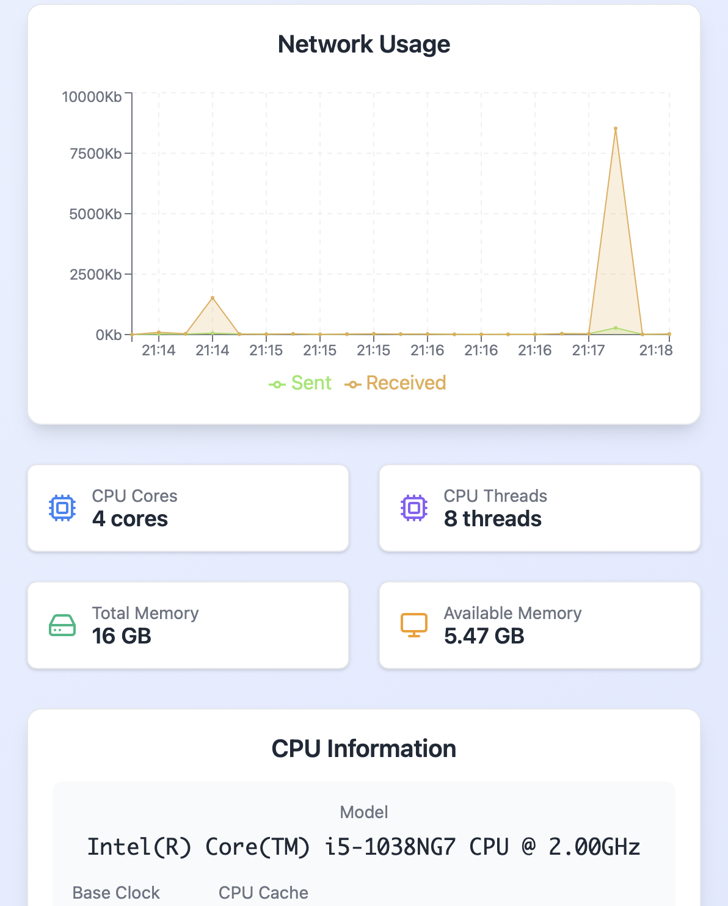

# Go Monitor
- Desktop application for system monitoring
- Displayed system data
  * Cpu live usage
  * Memory live usage
  * Cpu temperature
  * Cpu usage history
  * Network usage
  * Total and used memory
  * Cpu information
  * Overall system info

# Showcase

  
  
  

